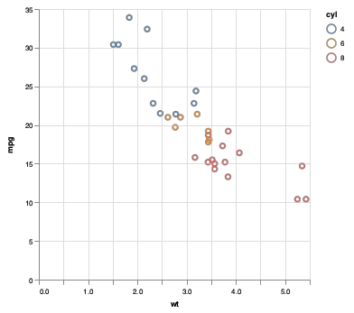

[](https://travis-ci.org/vegawidget/vegablock)
[](https://cran.r-project.org/package=vegablock)

<!-- README.md is generated from README.Rmd. Please edit that file -->

# vegablock

The goal of vegablock is to provide an interface between Vega and
Blocks.

The Blocks website <https://bl.ocks.org> provides a way to share
JavaScript-based visualizations using GitHub gists; the
[**vegawidget**](https://vegawidget.github.io/vegawidget) package
provides a way to compose and render Vega (JavaScript) visualizations
using R. This package provides a bridge between the Blocks website and
the vegawidget package.

If you have a GitHub account, you can use this package to deploy
Vega(-Lite) blocks. Further, if a block contains a Vega(-Lite)
specification and meets a specific format, you can use this package to
import such a specification to your R environment.

## Installation

For now, you can install vegablock from GitHub:

``` r
# install.package("devtools")
install_github("vegawidget/vegablock")
```

To make things easiest, you should have these environment variables set
in your `.Renviron` file:

  - `GITHUB_PAT` - GitHub [Personal Access Token
    (PAT)](https://github.com/settings/tokens).

  - `GITHUB_USERNAME` - your GitHub-account name

## Examples

``` r
library("vegablock")
library("vegawidget")
#> 
#> Attaching package: 'vegawidget'
#> The following objects are masked from 'package:vegablock':
#> 
#>     vw_block_config, vw_create_block, vw_create_block_gistid,
#>     vw_retrieve_block
```

With the enviroment varaibles set, you can create a block from vegaspec:

``` r
vw_create_block(spec_mtcars)
```

    #> block url: https://bl.ocks.org/06a512525fbe7a96e1a2028e1871b61c
    #>  gist url: https://gist.github.com/06a512525fbe7a96e1a2028e1871b61c

You can visit the created block
[here](https://bl.ocks.org/06a512525fbe7a96e1a2028e1871b61c).

If the block has a specific format, where the Vega(-Lite) specification
is in its own file, you can retrieve a vegaspec from a block into your R
environment:

``` r
vw_retrieve_block("06a512525fbe7a96e1a2028e1871b61c")
#> retrieving `spec.json` from gist 06a512525fbe7a96e1a2028e1871b61c
```

<!-- -->
